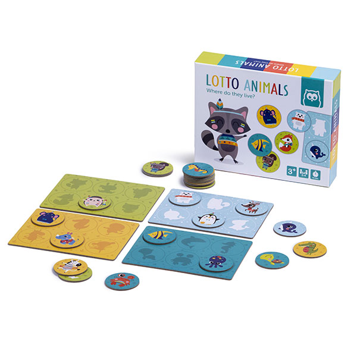
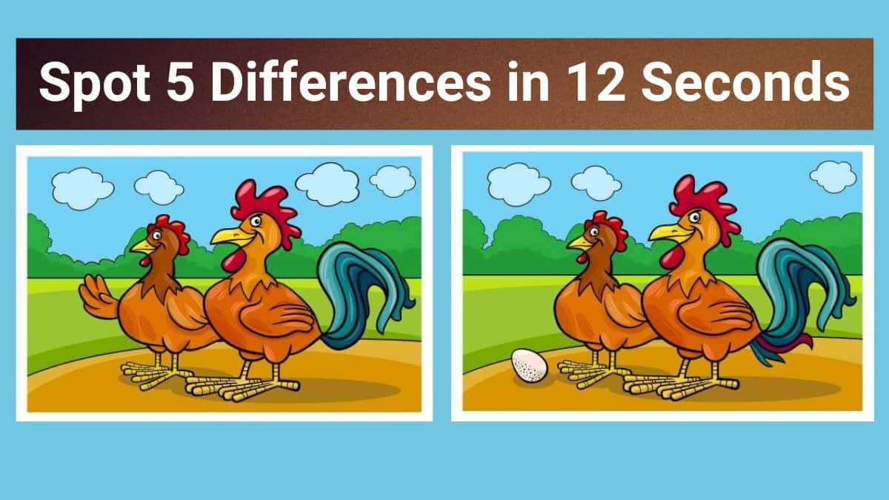

# Instrucciones de los juegos

## Juego 1: Lotto
El juego comienza con una tarjeta en la que se pueden observar siluetas (o sombras) de animales, frutas, objetos... Se pueden tener varias tarjetas de diferentes categorías.

El jugador tiene una serie de fichas con dibujos de la categoría en cuestión. Su tarea es colocar la ficha del dibujo encima de su silueta. Cuanto antes complete la tarjeta, mejor habrá realizado el ejercicio.

El proceso del juego es cíclico, siguiendo los siguientes pasos:
1. El jugador observa el tablero y sus fichas
2. El jugador arrastra la ficha que elija a una de las posiciones de la tarjeta
3a. Si la posición es correcta, la ficha queda en el sitio fijada y se reproduce un sonido que indique acierto.
3b. Si la posición es incorrecta, la ficha vuelve a la posesión del jugador y se reproduce un sonido que indique error.

## Juego 2: Encuentra las diferencias
El juego comieza con 2 imagenes muy similiares, pero no iguales. Estas poseen un número X de diferencias, que el jugador debe descifrar.

El jugador deberá tocar en una de las imágenes donde crea que existe diferencia. En caso de ser así, aparecerá un círculo en ambas fotos en la posición diferente. De lo contrario, no pasará nada.

